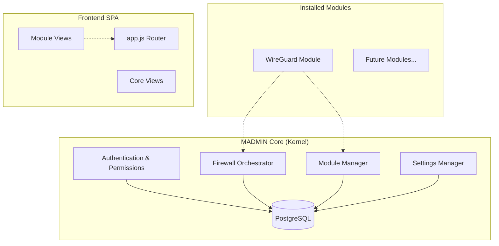

# MADMIN - Modular Admin System Implementation Plan

## Overview

Transform the legacy VPN Manager into **MADMIN**, a modular kernel-based admin system. The core handles authentication, settings, firewall orchestration, and module loading. Business logic (VPN, Hosting, etc.) lives in installable modules.

> [!IMPORTANT]
> This plan covers **Phase 1: Core Kernel** only. Subsequent phases will be planned after Phase 1 is complete and validated.

---

## User Review Required

> [!WARNING]
> **Database Migration**: This plan uses **PostgreSQL** instead of the current SQLite. This requires:
> 1. Installing PostgreSQL on the target machine
> 2. A fresh database schema (no migration from legacy SQLite data)
> 3. New async DB driver (asyncpg)

> [!IMPORTANT]
> **Breaking Change**: The new system is not backward-compatible with the legacy project. Users must:
> - Complete fresh installation
> - Manually recreate instances/clients after installing modules

---

## Architecture



---

## Proposed Changes

### Backend Structure

```text
madmin/
├── backend/
│   ├── main.py                     # FastAPI app factory & startup
│   ├── config.py                   # Environment config (Pydantic Settings)
│   ├── core/
│   │   ├── __init__.py
│   │   ├── database.py             # PostgreSQL async engine (asyncpg)
│   │   ├── auth/
│   │   │   ├── __init__.py
│   │   │   ├── models.py           # User, Permission, Role models
│   │   │   ├── router.py           # Auth endpoints (login, token, users)
│   │   │   ├── service.py          # Auth business logic
│   │   │   └── dependencies.py     # get_current_user, check_permission
│   │   ├── firewall/
│   │   │   ├── __init__.py
│   │   │   ├── models.py           # MachineFirewallRule, ModuleChain
│   │   │   ├── router.py           # Firewall API endpoints
│   │   │   ├── orchestrator.py     # Chain management, module hooks
│   │   │   └── iptables.py         # Low-level iptables wrapper
│   │   ├── modules/
│   │   │   ├── __init__.py
│   │   │   ├── models.py           # InstalledModule, ModuleManifest
│   │   │   ├── router.py           # Module install/list/remove APIs
│   │   │   ├── loader.py           # Dynamic module discovery & loading
│   │   │   └── manifest.py         # Manifest parser & validator
│   │   ├── settings/
│   │   │   ├── __init__.py
│   │   │   ├── models.py           # SystemSettings, SMTPSettings, BackupSettings
│   │   │   ├── router.py           # Settings CRUD endpoints
│   │   │   └── service.py          # Settings business logic
│   │   └── ui_router.py            # Dynamic menu generation for frontend
│   ├── modules/                    # Installed modules directory
│   │   └── .gitkeep
│   ├── staging/                    # Development modules
│   │   └── .gitkeep
│   └── requirements.txt
├── frontend/
│   ├── index.html                  # SPA entry point
│   ├── login.html                  # Standalone login page
│   └── assets/
│       ├── css/
│       │   └── app.css             # Core styles + Tabler overrides
│       └── js/
│           ├── app.js              # Main router & module loader
│           ├── api.js              # Fetch wrapper with auth
│           ├── utils.js            # Common utilities
│           └── views/
│               ├── dashboard.js
│               ├── users.js
│               ├── permissions.js
│               ├── firewall.js
│               └── settings.js
├── scripts/
│   ├── setup-madmin.sh             # Main installer
│   ├── enable-ip-forwarding.sh
│   ├── save-iptables.sh
│   └── restore-iptables.sh
└── nginx/
    └── madmin.conf
```

---

### Component Details

#### [NEW] [config.py](file:///c:/Users/dodof/OneDrive/Documenti/sites/VPNManager/madmin/backend/config.py)

Environment configuration using Pydantic Settings for type-safe config loading from `.env`:
- `DATABASE_URL`: PostgreSQL connection string
- `SECRET_KEY`: JWT signing key
- `DEBUG`: Debug mode flag
- `ALLOWED_ORIGINS`: CORS origins

---

#### [NEW] [database.py](file:///c:/Users/dodof/OneDrive/Documenti/sites/VPNManager/madmin/backend/core/database.py)

Async PostgreSQL connection using SQLAlchemy 2.0 + asyncpg:
- Async session factory
- Health check function
- Database initialization on startup

---

#### [NEW] [core/auth/models.py](file:///c:/Users/dodof/OneDrive/Documenti/sites/VPNManager/madmin/backend/core/auth/models.py)

SQLModel tables for granular permission system:

| Table | Description |
|-------|-------------|
| `User` | username (PK), hashed_password, is_active, is_superuser, created_at |
| `Permission` | slug (PK), description, module_id (nullable) |
| `UserPermission` | Link table: user_id, permission_slug |

- Superusers bypass permission checks
- Modules can register their own permissions via `module_id`

---

#### [NEW] [core/auth/router.py](file:///c:/Users/dodof/OneDrive/Documenti/sites/VPNManager/madmin/backend/core/auth/router.py)

Endpoints:
- `POST /token` - OAuth2 password flow login
- `GET /users/me` - Current user info + permissions
- `GET /users` - List users (admin only)
- `POST /users` - Create user (admin only)
- `PATCH /users/{username}` - Update user (admin only)
- `DELETE /users/{username}` - Delete user (admin only)
- `GET /permissions` - List all permissions
- `PUT /users/{username}/permissions` - Assign permissions

---

#### [NEW] [core/firewall/models.py](file:///c:/Users/dodof/OneDrive/Documenti/sites/VPNManager/madmin/backend/core/firewall/models.py)

| Table | Description |
|-------|-------------|
| `MachineFirewallRule` | id, chain (INPUT/OUTPUT/FORWARD), action, protocol, source, destination, port, state, comment, order |
| `ModuleChain` | module_id, chain_name, parent_chain, priority (for ordering) |

---

#### [NEW] [core/firewall/orchestrator.py](file:///c:/Users/dodof/OneDrive/Documenti/sites/VPNManager/madmin/backend/core/firewall/orchestrator.py)

Firewall orchestrator responsibilities:
1. Initialize `MADMIN_INPUT`, `MADMIN_OUTPUT`, `MADMIN_FORWARD` chains at startup
2. Provide API for modules to register their chains (e.g., `MOD_WIREGUARD_FWD`)
3. Order module chains by priority before core chains
4. Apply rules from DB on startup/change
5. Expose functions for modules: `register_chain()`, `add_rule()`, `apply_rules()`

---

#### [NEW] [core/modules/loader.py](file:///c:/Users/dodof/OneDrive/Documenti/sites/VPNManager/madmin/backend/core/modules/loader.py)

Module lifecycle:
1. Scan `modules/` directory for `manifest.json`
2. Validate manifest schema
3. Register module's FastAPI router at `/api/modules/{module_id}/`
4. Register module's static files at `/static/modules/{module_id}/`
5. Register module permissions in database
6. Register module firewall chains

---

#### [NEW] [core/modules/manifest.py](file:///c:/Users/dodof/OneDrive/Documenti/sites/VPNManager/madmin/backend/core/modules/manifest.py)

Manifest schema (`manifest.json`):
```json
{
  "id": "wireguard",
  "name": "WireGuard VPN",
  "version": "1.0.0",
  "description": "WireGuard VPN instance management",
  "author": "MADMIN Team",
  "permissions": [
    {"slug": "wireguard.view", "description": "View VPN instances"},
    {"slug": "wireguard.manage", "description": "Create/edit/delete instances"}
  ],
  "menu": [
    {"label": "WireGuard", "icon": "shield", "route": "#wireguard"}
  ],
  "firewall_chains": [
    {"name": "MOD_WG_FORWARD", "parent": "FORWARD", "priority": 10}
  ],
  "dependencies": []
}
```

---

#### [NEW] [core/settings/models.py](file:///c:/Users/dodof/OneDrive/Documenti/sites/VPNManager/madmin/backend/core/settings/models.py)

Singleton settings tables (id=1 always):
- `SystemSettings`: company_name, primary_color, logo_url, favicon_url
- `SMTPSettings`: host, port, encryption, username, password, sender_email, sender_name
- `BackupSettings`: enabled, frequency, time, remote_protocol, remote_host, etc.

---

### Frontend Structure

#### [NEW] [index.html](file:///c:/Users/dodof/OneDrive/Documenti/sites/VPNManager/madmin/frontend/index.html)

SPA shell with Tabler layout, dynamic sidebar, and content area:
- Loads `app.js` as ES module
- Hash-based routing (`#dashboard`, `#users`, etc.)

#### [NEW] [app.js](file:///c:/Users/dodof/OneDrive/Documenti/sites/VPNManager/madmin/frontend/assets/js/app.js)

Main application:
- Route mapping to view modules
- Dynamic menu rendering from API
- Module view loading for installed modules

---

### Installation Script

#### [NEW] [setup-madmin.sh](file:///c:/Users/dodof/OneDrive/Documenti/sites/VPNManager/madmin/scripts/setup-madmin.sh)

Steps:
1. Install system dependencies (Nginx, Python 3.12+, PostgreSQL 15+)
2. Create PostgreSQL database and user
3. Deploy backend to `/opt/madmin/backend`
4. Create Python venv, install requirements
5. Deploy frontend to `/opt/madmin/frontend`
6. Configure Nginx reverse proxy
7. Create systemd service `madmin.service`
8. Initialize database schema
9. Create default admin user
10. Print access URL and credentials

---

## Verification Plan

### Automated Tests

Since there are no existing tests in the legacy project, we will create new integration tests:

1. **Auth Tests** (`tests/test_auth.py`)
   ```bash
   cd madmin/backend
   python -m pytest tests/test_auth.py -v
   ```
   - Test login with valid/invalid credentials
   - Test permission checks (superuser bypass, regular user)
   - Test user CRUD operations

2. **Firewall Tests** (`tests/test_firewall.py`)
   ```bash
   cd madmin/backend
   python -m pytest tests/test_firewall.py -v
   ```
   - Test rule CRUD (mocked iptables)
   - Test chain registration for modules

3. **Module Loader Tests** (`tests/test_modules.py`)
   ```bash
   cd madmin/backend
   python -m pytest tests/test_modules.py -v
   ```
   - Test manifest validation
   - Test module router registration

### Manual Verification

After implementation, please verify on an **Ubuntu 24.04 VM**:

1. **Installation**
   ```bash
   git clone <repo> && cd madmin/scripts
   sudo bash setup-madmin.sh
   ```
   - Verify no errors during installation
   - Note the printed admin credentials

2. **Login Flow**
   - Open `http://<server-ip>` in browser
   - Login with admin credentials
   - Verify dashboard loads

3. **User Management**
   - Create a new user with limited permissions
   - Logout, login as new user
   - Verify restricted menu/actions

4. **Machine Firewall**
   - Add a test rule (e.g., DROP incoming TCP 12345)
   - Run: `sudo iptables -L MADMIN_INPUT -n -v`
   - Verify rule appears

5. **Settings**
   - Change company name
   - Verify header updates

> [!TIP]
> For local development without a VM, you can test the backend with mocked iptables calls:
> ```bash
> MOCK_IPTABLES=true python -m uvicorn main:app --reload
> ```

---

## Implementation Order

1. ✅ **Analyze legacy codebase** (completed)
2. ⬜ **Create project structure** - directories and empty files
3. ⬜ **Implement `config.py` and `database.py`** - PostgreSQL connection
4. ⬜ **Implement auth module** - models, router, dependencies
5. ⬜ **Implement firewall orchestrator** - models, iptables wrapper, orchestrator
6. ⬜ **Implement module manager** - loader, manifest parser
7. ⬜ **Implement settings module** - models, router
8. ⬜ **Create frontend SPA** - login, dashboard, core views
9. ⬜ **Create installation script** - setup-madmin.sh
10. ⬜ **Write tests** - auth, firewall, modules
